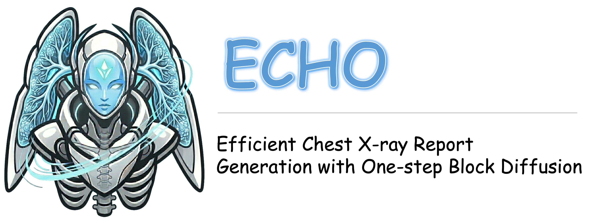
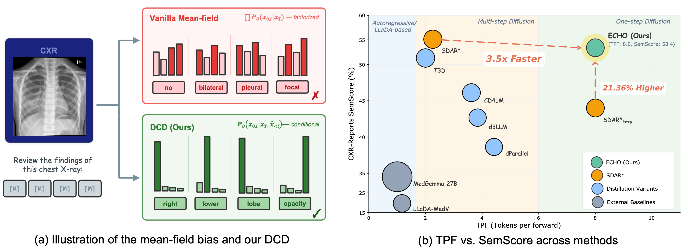

<div align="center">
  
  <br><br>
  <a href="./LICENSE"></a>
  &nbsp;
  <a href="https://echo-midea-airc.github.io/"></a>
  &nbsp;
  <a href="https://huggingface.co/collections/Midea-AIRC/echo"></a>
  &nbsp;
  <a href="https://echo-midea-airc.github.io/"></a>
  <br><br>
</div>

ECHO (Efficient Chest X-ray Report Generation with One-step Block Diffusion) is a discrete diffusion vision–language model for automated chest X-ray report generation. It converts a pretrained autoregressive model into a one-step-per-block decoder via Response-Asymmetric Diffusion (RAD) adaptation and Direct Conditional Distillation (DCD). DCD constructs non-factorized supervision from on-policy teacher trajectories, enabling coherent single-step decoding that was previously unachievable in discrete diffusion models. ECHO surpasses state-of-the-art autoregressive and diffusion-based methods while achieving up to an 8× inference speedup.

Highlights:

- 🏥 **State-of-the-Art Chest X-ray Report Generation** — surpasses both AR and diffusion-based SOTA, with large margins on clinical fidelity metrics (RaTEScore, SemScore)
- ⚡ **8× Inference Speedup** — one-step-per-block decoding via DCD distillation, with minimal quality degradation
- 🌐 **Bilingual** — supports both English and Chinese prompts and outputs for CXR report generation  


<!-- Below: add Overview, installation, model table, training, evaluation, and citation (see README.md). Replace arXiv href with paper abs when available. -->

## 🔥 Motivations

<p align="justify">Discrete diffusion language models approximate the joint token distribution through token factorization, treating each position as conditionally independent. This approximation ignores inter-token dependencies, requiring multi-step remasking to progressively recover output coherence. Each additional step, however, incurs an extra model forward pass, increasing inference latency and creating a fundamental quality–speed dilemma. ECHO resolves this through Direct Conditional Distillation (DCD), which constructs non-factorized supervision from the teacher's on-policy multi-step trajectories, enabling the student to capture joint token dependencies in a single forward pass per block — achieving multi-step quality at single-step speed.</p>

<div align="center">
  
</div>

<p align="justify">(a) Decoding all tokens simultaneously in one step produces incoherent outputs, as standard diffusion models predict each position independently. Our Direct Conditional Distillation (DCD) distills from a non-factorized target, yielding coherent one-step-per-block outputs. (b) Compared to both autoregressive and diffusion-based baselines, ECHO achieves a favorable trade-off between generation quality (SemScore) and decoding throughput (tokens per forward pass).</p>

## 🗺️ Roadmap

- [x] Inference code
- [x] Evaluation code
- [x] Model weights (HuggingFace)
- [ ] Training scripts — coming soon

## ⚙️ Usage

### Inference

```bash
git clone https://github.com/midea-ai/ECHO.git
cd ./ECHO/inference
pip install transformers==4.55.4
python generate_echo.py
```

Two inference scripts are provided under `inference/`:

- **`generate_echo.py`** — single-image inference for distilled ECHO models (`ECHO_block4/8`), with fused single-step decoding support.
- **`generate_vl_block.py`** — single-image inference for multi-step base models (`ECHO_Base_block4/8`), supporting configurable denoising steps and remasking strategies.

```bash
# ECHO (single-step, distilled)
python inference/generate_echo.py \
  --model_dir Midea-AIRC/ECHO_block4 \
  --image_path /path/to/image.jpg \
  --prompt_text "Review this chest X-ray and write a report.Use this format: Findings: {}, Impression: {}." \
  --block_length 4 \
  --denoising_steps 1

# ECHO_Base (multi-step)
python inference/generate_vl_block.py \
  --model_dir Midea-AIRC/ECHO_Base_block4 \
  --image_path /path/to/image.jpg \
  --prompt_text "这是一组胸部X光图像，请生成一份医学报告，包括所见和结论。以以下格式返回报告：所见：{} 结论：{}。" \
  --remasking_strategy "low_confidence_dynamic" \
  --block_length 4 \
  --denoising_steps 4
```

### Evaluation

See [`eval/README.md`](eval/README.md) for environment setup, batch inference, metric evaluation, and speed profiling.

## 🗂️ Model Zoo

All checkpoints live in the **[ECHO collection](https://huggingface.co/collections/Midea-AIRC/echo)** on Hugging Face.

| Model | Stage | Description | Link |
|------|--------|-------------|------|
| `ECHO_Base_block4` | RAD | Multi-step block diffusion (block length 4), teacher for distillation | [ECHO_Base_block4](https://huggingface.co/Midea-AIRC/ECHO_Base_block4) |
| `ECHO_Base_block8` | RAD | Multi-step block diffusion (block length 8), teacher for distillation | [ECHO_Base_block8](https://huggingface.co/Midea-AIRC/ECHO_Base_block8) |
| `ECHO_block4` | DCD | Single-step distilled student (block length 4) | [ECHO_block4](https://huggingface.co/Midea-AIRC/ECHO_block4) |
| `ECHO_block8` | DCD | Single-step distilled student (block length 8) | [ECHO_block8](https://huggingface.co/Midea-AIRC/ECHO_block8) |

> Both the **code** and **model weights** in this repository are released under the [Midea Model License Agreement - Non-Commercial Use Version](LICENSE). Use for research, study, and personal non-commercial purposes only. Commercial use is strictly prohibited.


## 👏 Acknowledge

We would like to express our gratitude to the following works ([SDAR](https://jetastra.github.io/SDAR/), [Lingshu](https://alibaba-damo-academy.github.io/lingshu/), [BD3LM](https://arxiv.org/abs/2503.09573)) for providing important model foundations for ECHO.

We would like to express our gratitude to the following works ([MIMIC-CXR](https://physionet.org/content/mimic-cxr/2.1.0/), [ReXGradient](https://huggingface.co/datasets/rajpurkarlab/ReXGradient-160K), [CheXpert Plus](https://aimi.stanford.edu/datasets/chexpert-plus) and [IU X-ray](https://huggingface.co/datasets/dz-osamu/IU-Xray)) for providing important dataset foundations for ECHO.

## 📬 Contact

For issues or inquiries:

- **Lifeng Chen**, Beijing Jiaotong University (lfchen@bjtu.edu.cn)
- **Hao Liu** (Corresponding Author), AI Research Center, Midea Group (liuhao249@midea.com)

## 🔬 Citation

```
@misc{chen2026echoefficientchestxray,
      title={ECHO: Efficient Chest X-ray Report Generation with One-step Block Diffusion}, 
      author={Lifeng Chen and Tianqi You and Hao Liu and Zhimin Bao and Jile Jiao and Xiao Han and Zhicai Ou and Tao Sun and Xiaofeng Mou and Xiaojie Jin and Yi Xu},
      year={2026},
      eprint={2604.09450},
      archivePrefix={arXiv},
      primaryClass={cs.LG},
      url={https://arxiv.org/abs/2604.09450}, 
}
```
